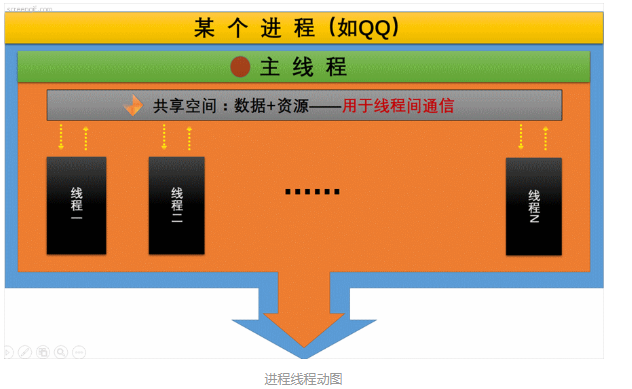

# 线程的理解
## 什么是线程？有什么用？怎么用？优化？
> 线程（独立调度和分派的基本单位）是操作系统能够进行运算调度的最小单位。它被包含在进程之中，是进程中的实际运作单位。一条线程指的是进程中一个单一顺序的控制流，一个进程中可以并发多个线程，每条线程并行执行不同的任务。在Unix System V及SunOS中也被称为轻量进程（lightweight processes），但轻量进程更多指内核线程（kernel thread），而把用户线程（user thread）称为线程。
 
 **线程和进程的区别？**
- 首先定义的区别
    - 进程：是执行中一段程序，即一旦程序被载入到内存中并准备执行，它就是一个进程。进程是表示资源分配的的基本概念，又是调度运行的基本单位，是系统中的并发执行的单位。
    - 线程：单个进程中执行中每个任务就是一个线程。线程是进程中执行运算的最小单位。
 - 其次，一个线程只能属于一个进程，但是一个进程中可以有多个线程。线程-->进程只能是一对一的关系，但是进程-->线程可以是一对多的关系，
 多线程就是一个进程中可以有多个线程同时执行。
 - 线程是一种轻量级的进程，所以相对来说，线程的给操作系统带来的创建，维护，管理，销毁开销所占用的资源要比进程少。
 - 线程没有地址空间，线程包含在进程的地址空间中。
 > 线程上下文只包含一个堆栈、一个寄存器、一个优先权，线程文本包含在他的进程
  的文本片段中，进程拥有的所有资源都属于线程。所有的线程 共享进程的内存和资源。 同一进程中的多个线程共享代码段(代码和常量)，
  数据段(全局变量和静态变量)，扩展段(堆存储)。但是每个线程拥有自己的栈段， 寄存器的内容，栈段又叫运行时段，用来存放所有局部变量和临时变量。

   
- 父进程和子进程使用进程间的通信机制，同一进程的线程通过读取和写入数据到进程变量来通信。
- 进程内的任何线程都被看做是同位体，且处于相同的级别。不管是哪个线程创建了哪一个线程，进程内的任何线程都可以销毁、挂起、恢复和更改其它线程的优先权。线程也要对进程施加控制，进程中任何线程都可以通过销毁主线程来销毁进程，销毁主线程将导致该进程的销毁，对主线程的修改可能影响所有的线程。
- 子进程不对任何其他子进程施加控制，进程的线程可以对同一进程的其它线程施加控制。子进程不能对父进程施加控制，进程中所有线程都可以对主线程施加控制。
- 相同点:
> 进程和线程都有ID/寄存器组、状态和优先权、信息块，创建后都可更改自己的属性，都可与父进程共享资源、都不鞥直接访问其他无关进程或线程的资源。
   
### 线程如何使用
#### 创建线程的几种方式？
1.**继承Thread类**
```java
public class ExtendThread extends Thread {

    @Override
    public void run() {
        System.out.println("线程继承");
    }


    public static void main(String[] args) {
        ExtendThread thread = new ExtendThread();
        thread.start();
    }
}
```
2.**实现Runnable接口**
```java
public class ImplementThread implements Runnable{

    private String value;

    public ImplementThread(String value) {
        this.value = value;
    }

    @Override
    public void run() {
        System.out.println("实现Runnable接口:"+ value);
    }

    public static void main(String[] args) {
        ImplementThread implementThread = new ImplementThread("test");
        Thread thread = new Thread(implementThread);
        thread.start();
    }
}
```
3.**实现Callable接口**
```java
public class CallableThread implements Callable<String> {
    @Override
    public String call() throws Exception {
        System.out.println("实现Callable接口");
        return "实现Callable接口";
    }


    public static void main(String[] args) throws ExecutionException, InterruptedException {
        CallableThread callableThread = new CallableThread();
        FutureTask<String> task = new FutureTask<String>(callableThread);
        task.run();
        String s = task.get();//当FutureTask处于未启动或已启动状态时，执行FutureTask.get()方法将导致调用线程阻塞。如果FutureTask处于已完成状态，调用FutureTask.get()方法将导致调用线程立即返回结果或者抛出异常
        System.out.println(s);

    }
}
```
#### 线程的执行策略
- 串行 \Longrightarrow [单线程]()

> 当前线程必须执行完之后下一个线程才能执行，效率慢，但是不会存在线程安全问题
 
   
- 并行 \Longrightarrow [多线程]()

>多个线程一起执行，处理速度快，但是存在线程安全问题

   


#### 三种创建线程方式有什么区别？
1.首先继承类和实现接口的区别
- 继承Thread类之后不能再继承其他类，
- // TODO.....


## **线程安全**
##### 什么是线程安全？
在了解线程安全之前，我们需要先了解Java内存模型([JMM](../java-concurrence/JMM.md))
> 线程安全就是多线程访问时，采用了加锁机制，当一个线程访问该类的某个数据时，进行保护，其他线程不能进行访问直到该线程读取完，其他线程才可使用。不会出现数据不一致或者数据污染。线程安全就是多线程访问时，采用了加锁机制，当一个线程访问该类的某个数据时，进行保护，其他线程不能进行访问直到该线程读取完，其他线程才可使用。不会出现数据不一致或者数据污染。
##### 如何保证线程安全？
> 保证线程安全性需要满足三个条件：原子性，可见性，有序性。
 
- 原子性
    - [Atomic]()
    - [Synchronized](../java-concurrence/synchronized原理.md)
 - 可见性
    - [volatile](../java-concurrence/volatile分析.md)
 - 有序性
    - [volatile](../java-concurrence/volatile分析.md)
    - [Synchronized](../java-concurrence/synchronized原理.md)
    - [Lock]()


   

