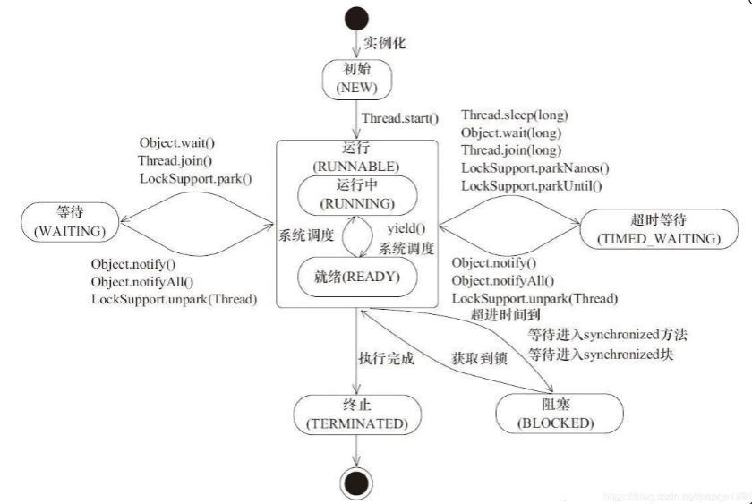
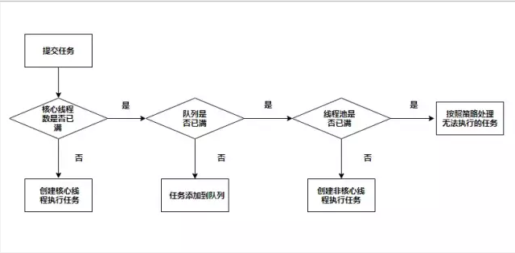

# 线程的理解
## 什么是线程？有什么用？怎么用？优化？
> 线程（独立调度和分派的基本单位）是操作系统能够进行运算调度的最小单位。它被包含在进程之中，是进程中的实际运作单位。一条线程指的是进程中一个单一顺序的控制流，一个进程中可以并发多个线程，每条线程并行执行不同的任务。在Unix System V及SunOS中也被称为轻量进程（lightweight processes），但轻量进程更多指内核线程（kernel thread），而把用户线程（user thread）称为线程。
 
**&spades;   线程和进程的区别？**
- 首先定义的区别
    - 进程：是执行中一段程序，即一旦程序被载入到内存中并准备执行，它就是一个进程。进程是表示资源分配的的基本概念，又是调度运行的基本单位，是系统中的并发执行的单位。
    - 线程：单个进程中执行中每个任务就是一个线程。线程是进程中执行运算的最小单位。
 - 其次，一个线程只能属于一个进程，但是一个进程中可以有多个线程。线程-->进程只能是一对一的关系，但是进程-->线程可以是一对多的关系，
 多线程就是一个进程中可以有多个线程同时执行。
 - 线程是一种轻量级的进程，所以相对来说，线程的给操作系统带来的创建，维护，管理，销毁开销所占用的资源要比进程少。
 - 线程没有地址空间，线程包含在进程的地址空间中。
 > 线程上下文只包含一个堆栈、一个寄存器、一个优先权，线程文本包含在他的进程
  的文本片段中，进程拥有的所有资源都属于线程。所有的线程 共享进程的内存和资源。 同一进程中的多个线程共享代码段(代码和常量)，
  数据段(全局变量和静态变量)，扩展段(堆存储)。但是每个线程拥有自己的栈段， 寄存器的内容，栈段又叫运行时段，用来存放所有局部变量和临时变量。

   
- 父进程和子进程使用进程间的通信机制，同一进程的线程通过读取和写入数据到进程变量来通信。
- 进程内的任何线程都被看做是同位体，且处于相同的级别。不管是哪个线程创建了哪一个线程，进程内的任何线程都可以销毁、挂起、恢复和更改其它线程的优先权。线程也要对进程施加控制，进程中任何线程都可以通过销毁主线程来销毁进程，销毁主线程将导致该进程的销毁，对主线程的修改可能影响所有的线程。
- 子进程不对任何其他子进程施加控制，进程的线程可以对同一进程的其它线程施加控制。子进程不能对父进程施加控制，进程中所有线程都可以对主线程施加控制。
- 相同点:
> 进程和线程都有ID/寄存器组、状态和优先权、信息块，创建后都可更改自己的属性，都可与父进程共享资源、都不鞥直接访问其他无关进程或线程的资源。
   
### 线程如何使用
#### 创建线程的几种方式？
1.**继承Thread类**
```java
public class ExtendThread extends Thread {

    @Override
    public void run() {
        System.out.println("线程继承");
    }


    public static void main(String[] args) {
        ExtendThread thread = new ExtendThread();
        thread.start();
    }
}
```
2.**实现Runnable接口**
```java
public class ImplementThread implements Runnable{

    private String value;

    public ImplementThread(String value) {
        this.value = value;
    }

    @Override
    public void run() {
        System.out.println("实现Runnable接口:"+ value);
    }

    public static void main(String[] args) {
        ImplementThread implementThread = new ImplementThread("test");
        Thread thread = new Thread(implementThread);
        thread.start();
    }
}
```
3.**实现Callable接口**
```java
public class CallableThread implements Callable<String> {
    @Override
    public String call() throws Exception {
        System.out.println("实现Callable接口");
        return "实现Callable接口";
    }


    public static void main(String[] args) throws ExecutionException, InterruptedException {
        CallableThread callableThread = new CallableThread();
        FutureTask<String> task = new FutureTask<String>(callableThread);
        task.run();
        String s = task.get();//当FutureTask处于未启动或已启动状态时，执行FutureTask.get()方法将导致调用线程阻塞。如果FutureTask处于已完成状态，调用FutureTask.get()方法将导致调用线程立即返回结果或者抛出异常
        System.out.println(s);

    }
}
```

 **&spades;  三种创建线程方式有什么区别？**
 
1.首先继承类和实现接口的区别
- 继承Thread类之后不能再继承其他类，
- // TODO.....

#### 线程的状态
> 线程的状态实现通过 Thread.State 常量类实现，有 6 种线程状态：new（新建）、runnnable（可运行）、blocked（阻塞）、waiting（等待）、time waiting （定时等待）和 terminated（终止）
。状态流转图如下: 
  
  
线程状态流程大致如下：
- 线程创建后，进入 new 状态
- 调用 start 或者 run 方法，进入 runnable 状态
- JVM 按照线程优先级(<font size=3 color="grey">线程优先级的范围是 1 到 10 ，其中 1 是最低优先级，10 是最高优先级</font>)及时间分片等执行 runnable 状态的线程。开始执行时，进入 running 状态
- 如果线程执行 sleep、wait、join，或者进入 IO 阻塞等。进入 wait 或者 blocked 状态
- 线程执行完毕后，线程被线程队列移除。最后为 terminated 状态。

#### 线程的执行策略
- 串行 	&rArr; [单线程]()
> 当前线程必须执行完之后下一个线程才能执行，效率慢，但是不会存在线程安全问题
<div align=center></div>

- 并行 	&rArr; [多线程](#multithread)
>多个线程一起执行，处理速度快，但是存在线程安全问题
<div align=center></div>


## **<span id="multithread">多线程</span>**
>上面提到线程的执行策略，这里重点了解一下并行模式，也就是我们常说的多线程

### 什么是多线程?
>多线程（英语：multithreading），是指从软件或者硬件上实现多个线程并发执行的技术。具有多线程能力的计算机因有硬件支持而能够在同一时间执行多于一个线程，进而提升整体处理性能。具有这种能力的系统包括对称多处理机、多核心处理器以及芯片级多处理（Chip-level multithreading）或同时多线程（Simultaneous multithreading）处理器。在一个程序中，这些独立运行的程序片段叫作“线程”（Thread），利用它编程的概念就叫作“多线程处理（Multithreading）”。
简单理解的话：就是多个单线程同时执行(使用不当会出现[线程安全](#safeThread)问题)。

### 怎么处理多线程 ?
> [线程池](#threadPool)是一种多线程处理方法，处理过程中将任务添加到队列，然后在创建线程后自动启动这些任务。线程池线程都是后台线程，每个线程使用默认的堆栈大小，以默认的优先级运行，并处于多线程单元中。如果某个线程处于空闲状态，线程池将会调度一个任务给它。如果所有线程都始终保持繁忙，但将任务放入到一个队列中，则线程池将在过一段时间后创建另一个辅助线程，但线程的数目永远不会超过最大值。超过最大值的线程可以排队，但他们要等到其他线程完成后才启动

`对比一下线程池的优缺点，在看看如何创建线程`
#### 使用线程池的优点 ?
- 减少资源创建 => 减少内存开销，创建线程占用内存
- 降低系统开销 => 创建线程需要时间，会延迟处理的请求
- 提高稳定稳定性 => 避免无限创建线程引起的OutOfMemoryError【简称OOM】
#### 使用线程池的缺点 ?
> 线程使用不当，会出现线程安全问题


<span id="threadPoolPicture">线程池类图</span>关系如下：
<div align=center></div>


#### <span id="threadPool">怎么创建线程池</span> ?
> 根据返回的对象类型创建线程池可以分为三类：
- 创建返回[ThreadPoolExecutor](#threadPoolExecutor)对象
- 创建返回ScheduleThreadPoolExecutor对象
- 创建返回ForkJoinPool对象
##### <span id="threadPoolExecutor">ThreadPoolExecutor对象</span>
>ThreadPoolExecutor构造参数介绍
```java

public ThreadPoolExecutor(int corePoolSize, //线程池核心线程数量
                              int maximumPoolSize, //线程池最大数量
                              long keepAliveTime, //空闲线程存活时间
                              TimeUnit unit, // 时间单位
                              BlockingQueue<Runnable> workQueue, //线程池所使用的缓冲队列
                              ThreadFactory threadFactory, //线程池创建线程使用的工厂
                              RejectedExecutionHandler handler) { //线程池对拒绝任务的处理策略
        if (corePoolSize < 0 ||
            maximumPoolSize <= 0 ||
            maximumPoolSize < corePoolSize ||
            keepAliveTime < 0)
            throw new IllegalArgumentException();
        if (workQueue == null || threadFactory == null || handler == null)
            throw new NullPointerException();
        this.acc = System.getSecurityManager() == null ?
                null :
                AccessController.getContext();
        this.corePoolSize = corePoolSize;
        this.maximumPoolSize = maximumPoolSize;
        this.workQueue = workQueue;
        this.keepAliveTime = unit.toNanos(keepAliveTime);
        this.threadFactory = threadFactory;
        this.handler = handler;
    }
```
> 线程池执行任务逻辑和线程池参数的关系
>


执行逻辑说明：

- 判断核心线程数是否已满，核心线程数大小和corePoolSize参数有关，未满则创建线程执行任务
- 若核心线程池已满，判断队列是否满，队列是否满和workQueue参数有关，若未满则加入队列中
- 若队列已满，判断线程池是否已满，线程池是否已满和maximumPoolSize参数有关，若未满创建线程执行任务
- 若线程池已满，则采用拒绝策略处理无法执执行的任务，拒绝策略和handler参数有关

**Executors创建返回ThreadPoolExecutor对象**

Executors创建返回ThreadPoolExecutor对象的方法共有四种：

- Executors#[newCachedThreadPool](#newCachedThreadPool) => 创建可缓存的线程池
- Executors#[newSingleThreadExecutor](#newSingleThreadExecutor) => 创建单线程的线程池
- Executors#[newFixedThreadPool](#newFixedThreadPool) => 创建固定长度的线程池
- Executors#[newWorkStealingPool](#newWorkStealingPool) => 创建一个具有抢占式操作的线程池

##### <span id="newCachedThreadPool">newCachedThreadPool</span>: 创建可缓存的线程池
```java
 public static ExecutorService newCachedThreadPool() {
        return new ThreadPoolExecutor(0, Integer.MAX_VALUE,
                                      60L, TimeUnit.SECONDS,
                                      new SynchronousQueue<Runnable>());
    }
```

查看源码可以看到：
- 线程池核心线程数量(corePoolSize):0
- 线程池最大数量(maximumPoolSize): Integer.MAX_VALUE，可以认为最大线程数是无限的
- 空闲线程存活时间(keepAliveTime): 60L
- 线程存活时间单位(unit)：秒
- 线程池所使用的缓冲队列(workQueue)：[SynchronousQueue]()

newCachedThreadPool流程图如下：
<div align=center></div>

> 当一个任务提交时，corePoolSize为0不创建核心线程，SynchronousQueue是一个不存储元素的队列，可以理解为队里永远是满的，因此最终会创建非核心线程来执行任务。
  
> 对于非核心线程空闲60s时将被回收。因为Integer.MAX_VALUE非常大，可以认为是可以无限创建线程的，在资源有限的情况下容易引起OOM异常

newCachedThreadPool具体使用：
```java
public class CachedThreadPoolTest implements  Runnable {
    @Override
    public void run() {
        System.out.println("实现Runnable接口");
    }

     public static void main(String[] args) {
           ExecutorService executor = Executors.newCachedThreadPool();
           executor.execute(new CachedThreadPoolTest());
       }

}
```
##### <span id="newSingleThreadExecutor">newSingleThreadExecutor</span>: 创建单线程的线程池
```java
   public static ExecutorService newSingleThreadExecutor() {
        return new FinalizableDelegatedExecutorService
            (new ThreadPoolExecutor(1, 1,
                                    0L, TimeUnit.MILLISECONDS,
                                    new LinkedBlockingQueue<Runnable>()));
    }
```
查看源码可以看到：
- 线程池核心线程数量(corePoolSize):1
- 线程池最大数量(maximumPoolSize): 1，只可以创建一个非核心线程
- 空闲线程存活时间(keepAliveTime): 0L
- 线程存活时间单位(unit)：秒
- 线程池所使用的缓冲队列(workQueue)：[LinkedBlockingQueue]()

<span id="newSingleThreadExecutorPic">newSingleThreadExecutor流程图如下</span>：
<div align=center></div>


> 当一个任务提交时，首先会创建一个核心线程来执行任务，如果超过核心线程的数量，将会放入队列中，因为LinkedBlockingQueue是长度为Integer.MAX_VALUE的队列，可以认为是无界队列，因此往队列中可以插入无限多的任务，
>在资源有限的时候容易引起OOM异常，同时因为无界队列，maximumPoolSize和keepAliveTime参数将无效，压根就不会创建非核心线程

具体使用:
```java
public class ImplementRunnable implements  Runnable {
    @Override
    public void run() {
        System.out.println("实现Runnable接口");
    }

    public static void main(String[] args) {
        ExecutorService executor = Executors.newSingleThreadExecutor();
        executor.execute(new ImplementRunnable());
    }
}
```

##### <span id="">newFixedThreadPool</span>:  创建固定长度的线程池
```java
public static ExecutorService newFixedThreadPool(int nThreads) {
        return new ThreadPoolExecutor(nThreads, nThreads,
                                      0L, TimeUnit.MILLISECONDS,
                                      new LinkedBlockingQueue<Runnable>());
    }
```
查看源码可以看到：
- 线程池核心线程数量(corePoolSize):nThreads[传入的核心线程数量]
- 线程池最大数量(maximumPoolSize): nThreads[传入的核心线程数量]
- 空闲线程存活时间(keepAliveTime): 0L
- 线程存活时间单位(unit)：秒
- 线程池所使用的缓冲队列(workQueue)：[LinkedBlockingQueue]()

流程图见[newSingleThreadExecutor](#newSingleThreadExecutorPic)流程图

> 它和SingleThreadExecutor类似，唯一的区别就是核心线程数不同，并且由于使用的是LinkedBlockingQueue，在资源有限的时候容易引起OOM异常

具体使用:
```java
public class ImplementRunnable implements  Runnable {
    @Override
    public void run() {
        System.out.println("实现Runnable接口");
    }

    public static void main(String[] args) {
        ExecutorService executor = Executors.newFixedThreadPool(5);//五个核心线程数
        executor.execute(new ImplementRunnable());
    }

}
```


### <span id="safeThread">什么是线程安全</span> ?
在了解线程安全之前，我们需要先了解Java内存模型([JMM](../java-concurrence/JMM.md))
> 线程安全就是多线程访问时，采用了加锁机制，当一个线程访问该类的某个数据时，进行保护，其他线程不能进行访问直到该线程读取完，其他线程才可使用。不会出现数据不一致或者数据污染。线程安全就是多线程访问时，采用了加锁机制，当一个线程访问该类的某个数据时，进行保护，其他线程不能进行访问直到该线程读取完，其他线程才可使用。不会出现数据不一致或者数据污染。
### 如何保证线程安全？
> 保证线程安全性需要满足三个条件：原子性，可见性，有序性。
 
- 原子性
    - [Atomic]()
    - [Synchronized](../java-concurrence/synchronized原理.md)
 - 可见性
    - [volatile](../java-concurrence/volatile分析.md)
 - 有序性
    - [volatile](../java-concurrence/volatile分析.md)
    - [Synchronized](../java-concurrence/synchronized原理.md)
    - [Lock]()


   

