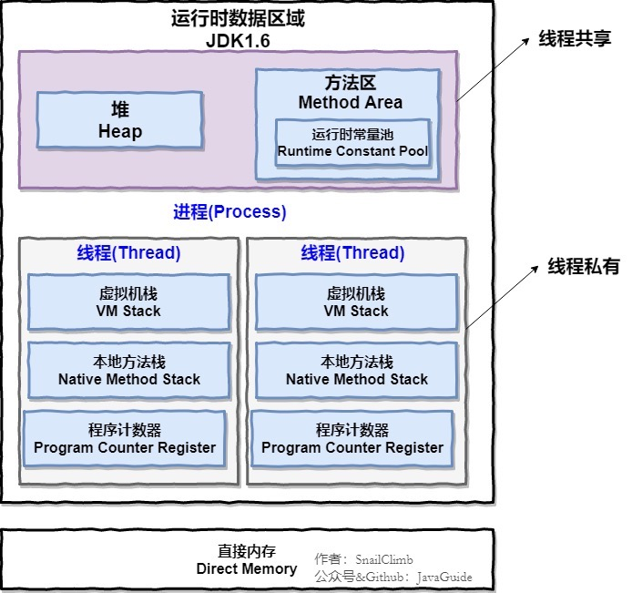
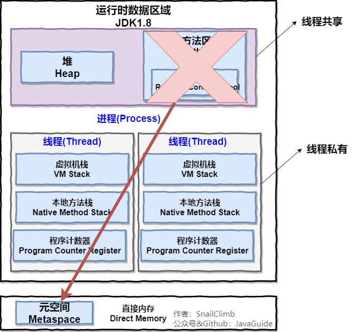

## java内存模型
  > 通常我们说的java内存模型，一般是指jvm运行数据区域。在jdk1.8之前jvm内存区域主要分为堆，方法区(包含运行时常量)，程序计数器，虚拟机栈，本地方法栈
>其中堆和方法区为线程共享区域，本地方法栈，虚拟机栈，程序计数器为线程私有。jdk1.8之后jvm内存区域主要包括堆(共享线程)，程序计数器(线程私有)，虚拟机栈(线程私有)，
>本地方法栈(线程私有)。jdk1.8之后将方法区(永久代)从jvm中移除，改为使用本地直接内存存储类的元数据信息，并命名为元空间。

jdk1.8之前java内存模型

jdk1.8之后java内存模型

### java内存区域介绍

#### 堆(Heap)
> 堆是java虚拟机管理内存中占用最大的一块，它是所有线程共享的一片区域，随着虚拟机的启动而创建，java堆的主要作用就是存放对象的实例和数组。
>因为java堆主要的作用是存放对象的实例，所以垃圾收集器管理的主要区域就在堆内存区域，因此堆也被称为GC堆。从垃圾回收的角度来说
>，现在的垃圾回收算法都采用分代垃圾回收。所以java堆还可以细分为新生代和老年代，在细分一点：Eden空间,From Survivor,To Survivor空间等。
>划分这么细的目的是为了更好的管理内存区域(分配和回收)。

#### 方法区(Method Area)
> 方法区和堆一样，在java内存模型中，也是线程共享的。方法区主要存储被虚拟机已加载的类信息,变量,静态常量和即时被编译器编译后的代码等数据。
>如果方法区无法满足新的内存分配需求时，则会出现[内存溢出](../../面试准备/Java基础/Java异常.md#outOfMemoryError)错误

#### 程序计数器(Program Counter Register)
> 程序计数器在jvm里所占的内存空间比其他区域都要小，他可以看作是当前线程所执行字节码的行号指示器。通俗来讲，他的作用就是
>用来标记被编译后的字节码执行到了哪一行，循环,分支,跳转,异常处理,线程处理都需要程序计数器来依赖完成。因为java虚拟机的
>多线程是通过线程轮流切换,分配处理器的执行时间的方式来实现的，所以为了线程切换后能恢复到正确的执行位置，所以每条线程都
需要一个独立的程序计数器来保证线程之间互不影响。程序计数器是java虚拟机中唯一不会出现内存溢出的地方，当执行native方法时，
>程序计数器的值为Undefined。

#### 虚拟机栈(Virtual Machine Stack)
> 和程序计数器一样，java虚拟机栈也是线程私有的。java虚拟机栈的生命周期和虚拟机相同，虚拟机的启动时虚拟机栈会创建一个
>[栈帧](#)(用于存储局部变量表,操作数栈,动态连接,方法出口等信息)，每个方法从被调用到执行完成，都对应着一个栈帧从入栈到出栈
>的过程。java虚拟机栈里主要存储的是局部变量表，通俗来将，局部变量表里面包括:基本数据类型(int,long,boolean,char
>short,byte,float,double),对象引用,returnAddress类型。需要注意的是这些基本数据类型在局部变量表中以局部变量槽来作为
>存储空间，其中64位的long和double占用两个变量槽，其余的数据类型只占用一个变量槽。《Java虚拟机规范》中规定了这个内存
>区域只会出现两类异常状况:
- 当线程请求栈的深度大于虚拟机所允许的最大限度，会抛出[StackOverflowError](../../面试准备/Java基础/Java异常.md#stackOverflowError)。
- 如果java虚拟机栈允许动态扩容时，当栈扩容无发申请到足够的内存时会抛出[OutOfMemoryError](../../面试准备/Java基础/Java异常.md#outOfMemoryError)。

#### 本地方法栈(Native Method Stacks)
> 本地方法栈和虚拟机栈大同小异，不同的是虚拟机栈是为java方法(字节码)服务，本地方法栈是为Native修饰的方法服务。他们的相同点如下:
- 都是线程私有
- 本地方法被执行的时候，在本地方法栈也会创建一个栈帧，用于存放该本地方法的局部变量表、操作数栈、动态链接、出口信息。
- 方法执行完毕后相应的栈帧也会出栈并释放内存空间，也会出现 [StackOverFlowError](../../面试准备/Java基础/Java异常.md#stackOverflowError) 
和 [OutOfMemoryError](../../面试准备/Java基础/Java异常.md#outOfMemoryError) 两种异常。
 

>

