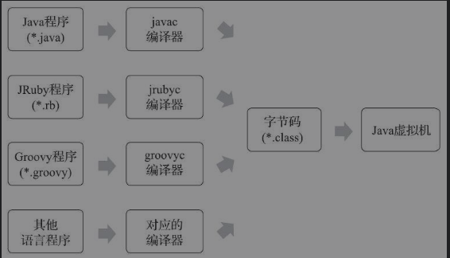
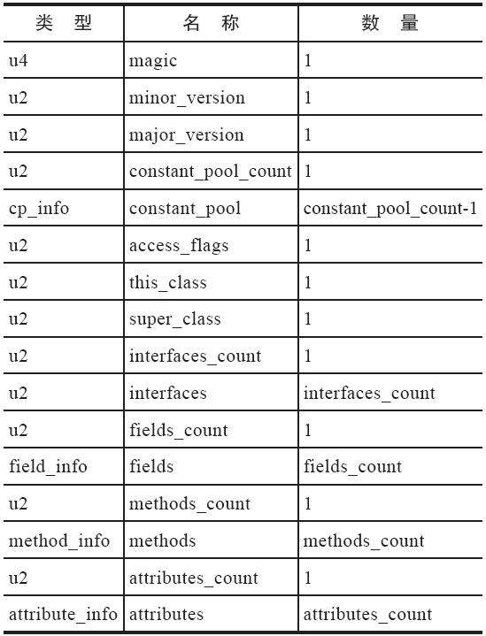
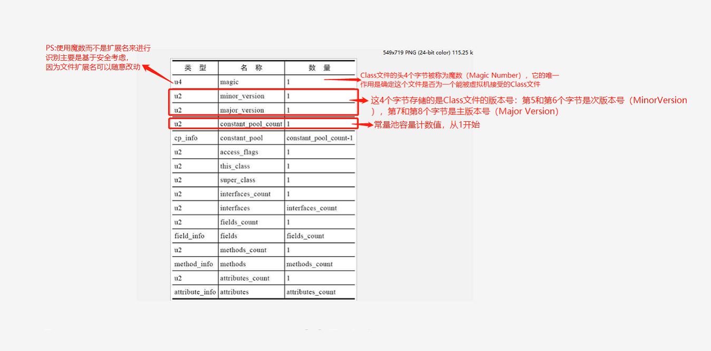

## 类文件结构

####class类文件结构
> Class文件是一组以8个字节为基础单位的二进制流，各个数据项目严格按照顺序紧凑地排列在文件之中，中间没有添加任何分隔符，这使得整个Class文件中存储的内容几乎全部是程序运行的必要数据，没有空隙存在。当遇到需要占用8个字节以上空间的数据项时，则会按照高位在前[插图]的方式分割成若干个8个字节进行存储

####class文件结构

> class文件格式采用类似C语言结构体的伪结构来存储数据，主要有"无符号数"和"表"两种数据类型。class文件的解析都要以这两种数据接口为依据
>其中"无符号数"属于基本数据类型，以u1，u2，u4，u8来分别来表示一字节，二字节，四字节，八字节的"无符号数"。无符号数可以用来描述数字、索引引用、数量值或者按照UTF-8编码构成字符串值。

>表是由多个无符号数或者其他表作为数据项构成的复合数据类型，为了便于区分，所有表的命名都习惯性地以“_info”结尾
>

