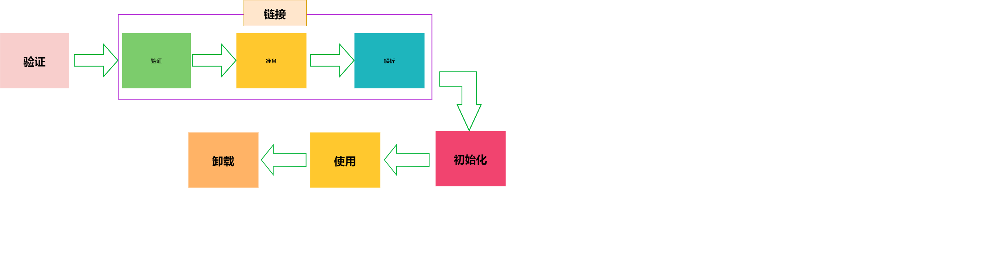

## **类加载过程**
> 类加载主要分为三步:加载,连接,初始化。

下面，我们将逐步对这三部分进行了解：
### **加载**
> 第一步"加载"，细分的话，大致也分为三步：
- 通过全类名(本地java文件编译后的class文件, zip/jar包里的class文件,以及通过网络加载的class文件)获取定义该类的二进制字节流
- 将字节流所代表的静态存储结构转换为方法区的运行时数据结构
- 在内存中生成一个代表该类的Class对象，作为方法区访问这些数据的入口
### **连接**
### **初始化**
